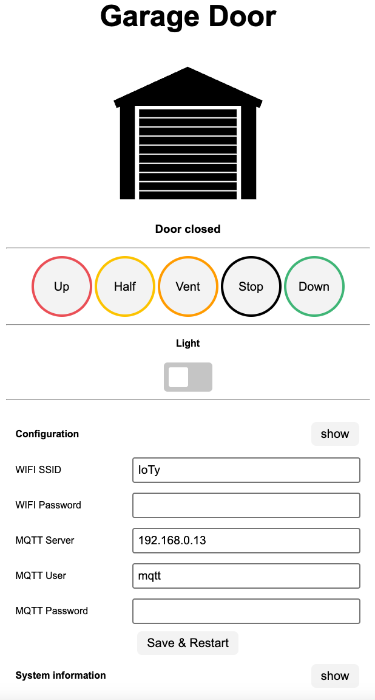

# Hörmann HCPBridge with MQTT and HomeAssistant Support


Emulates Hörmann UAP1-HCP board (HCP2= Hörmann communication protocol 2) using an ESP32 and a RS485 converter, and exposes garage door controls over web page and MQTT.

**Compatible with the following motors (UAP1-HCP / HCP2-Bus / Modbus):**

* SupraMatic E/P **Serie 4**
* ProMatic **Serie 4**
* [Rollmatic v2](docs/rollmatic_v2.md)

It is **not** compatible with E**3** series motors. Previous generations have different protocol (HCP1), different pin layout, and already have another supporting project (see [hgdo](https://github.com/steff393/hgdo), [hoermann_door](https://github.com/stephan192/hoermann_door) or [hormann-hcp](https://github.com/raintonr/hormann-hcp)).

## Functions

* Get current status (door open/close/position, light on/off)
* Support for ESP32-S1/S2/S3
* Support multiple HCP Bridges for multiple garage doors
* HomeAssistant integration via MQTT-AutoDiscovery
* Trigger actions via Webinterface
  * light on/off
  * gate open, close, stop
  * gate position: half, ventilation, custom (MQTT set_position compatible)
* Configuration (Wifi, MQTT, ...) via Web Interface
* Web Service [API](#web-service)
* OTA Update (with username and password)
* First Use Hotspot for configuration
* External (optional) sensor support (threshold orientated MQTT messages):
  * DS18X20 temperature sensor
  * BME280 temperature and humidity sensor
  * DHT22 temperature and humidity sensor
  * HC-SR04 proximity sensor (car (below) detection)
  * HC-SR501 PIR motion sensor
* Efficient MQTT traffic (send only MQTT Message if states changed)

## Web Interface

***http://[deviceip]***



## Configuration
At first boot the settings from the configuration.h file are taken over as user preferences. If you choose to make your own build you can setup your settings there.
After first boot you can change your settings directly in the Web interface without the need to create a new build. 

With the default configuration it will open a Wifi Hotspot you can connect to. When connected to it you can use the url http://192.168.4.1 in a webbrowser to access the Web Interface and configure the device.

Use the Basic Configuration section to set your wifi and MQTT credentials, after hitting the Save button your device will reboot.
The Password fields are redacted if there are set with a *. If you don't want to change it just leave the * as it will be interpretet as no change.


The preferences will stay even after a OTA update.
When the memory of your ESP get's deleted your ESP will again load the settings from the configuration.h file.

You can reset all preferences by pressing the BOOT button on the ESP for longer then 5 Seconds and releasing it.
This will reset all preferences to the default values from configuration.h in the flashed firmware build.

## Web Services

<details>
<summary>Send commands</summary>

URL: **http://[deviceip]/command?action=[id]**
<br>

| id | Function | Other Parameters
|--------|--------------|--------------|
| 0 | Close | |
| 1 | Open | |
| 2 | Stop | |
| 3 | Ventilation | |
| 4 | Half Open | |
| 5 | Light toggle | |
| 6 | Restart | |
| 7 | Set Position | position=[0-100] |

</details>

<details>
<summary>Status report</summary>

URL: **http://[deviceip]/status**
<br>

Response:
```
{
"valid": true,
"doorstate": 64,
"doorposition": 0,
"doortarget": 0,
"lamp": false,
"temp": 19.94000053,
"lastresponse": 0,
"looptime": 1037,
"lastCommandTopic": "hormann/garage_door/command/door",
"lastCommandPayload": "close"
}
```
</details>

<details>
<summary>Wifi status</summary>

URL: **http://[deviceip]/sysinfo**
<br>
</details>

<details>
<summary>OTA Firmware update</summary>

URL: **http://[deviceip]/update**
<br>


</details><br>

# Let`s build it! 🔨

## Wiring


ESP32 powering requires a Step Down Module such as LM2596S DC-DC, but any 24VDC ==> 5VDC will do, even the tiny ones with 3 pin.
Please note that the suggested serial pins for serial interfacing, on ESP32, are 16 RXD and 17 TXD.


<details>
<summary>It is possible to implement it with protoboard and underside soldering:</summary>

<br>


</details>

## RS485

<details open>
<summary>Pinout RS485 Plug</summary>
<br>


> 📌 **Pinout**
> 1. GND (Blue)<br>
> 2. GND (Yellow)<br>
> 3. B- (Green)<br>
> 4. A+ (Red)<br>
> 5. \+24V (Black)<br>
> 6. \+24V (White)<br>

</details>

### RS485 Adapter

> [!NOTE]<br>
> Pins A+ (Red) and B- (Green) need a 120 Ohm resistor between them for BUS termination. Some RS485 adapters provide termination pad to be soldered.

## Upload the firmware
To use the board without any additional sensors (f.e. as showed in section [wiring](#wiring)) you only need to upload the standard firmware binary.
### Sensors

To use additional sensors, you have also to build and upload the according firmware for the sensor. See [flash instructions](docs/flashing_instructions.md) for further info.
<details>
<summary>DS18X20 Temperature Sensor</summary>

 <br/>
DS18X20 connected to GPIO4.
<br>

</details>

<details>
<summary>HC-SR501 PIR Motion sensor</summary>
Digital out connected to GPIO23.
<br>
</details>

<details>
<summary>DHT22 Temperature and humudity Sensor</summary>
Digital out connected to GPIO27.
<br>
</details>

<details>
<summary>BME280 Temperature and humudity Sensor</summary>

 <br/>
SDA connected to  GPIO21<br>
SCL/SCK connected to GPIO22<br>
<br>
</details>

<details>
<summary>HC-SR04 Ultra sonic proximity sensor</summary>

<br>
Use the project task for HC-SR04.
The wiring pins are:<br>
SR04 Trigger pin is connected to GPIO5<br>
SR04 ECHO pin is connected to GPIO18<br><br>

It will send an mqtt discovery for two sensor one for the distance in cm available below the sensor and the other informing if the car park is available. It compare if the distance below is less than the maximal measured distance then car park is not available. The hcsr04_maxdistanceCm is defined with 150cm in configuration.h. This setting might not work for everyone. Change it to your needs.

</details>

## Installation

* Connect the board to the BUS
* Run a BUS scan (differs on the following hardware version): 

### Old Hardware version

BUS scan is started through flipping (ON - OFF) last dip switch. Note that BUS power  (+24v) is removed when no devices are detected. In case of issues, you may find useful to "jump start" the device using the +24V provision of other connectors of the motor control board.
  
### New Hardware version 
With newer HW versions, the bus scan is carried out using the LC display in menu 37. For more see: [Supramatic 4 Busscan](https://www.tor7.de/news/bus-scan-beim-supramatic-serie-4-fehlercode-04-vermeiden)


## Set the ventilation position 

This is just a quick and dirty implementation and needs refactoring, but it is working.
Using the Shutter Custom Card (from HACS) it is also possible to get a representation of the current position of the door, and slide it to custom position (through set_position MQTT command).

The switch for the venting position works with a small hack. Based on the analyses of dupas.me the motor should gave a status 0x0A in venting position. As this was not the case the variable VENT_POS in hciemulator.h was default with value '0x08' which correspond to the position when the garage door is in venting position (position available under ***http://[deviceip]/status***). When the door is stopped in this position the doorstate is set as venting.

<details>
<summary>HomeAssistant shutter cards</summary>

<br>


</details>
