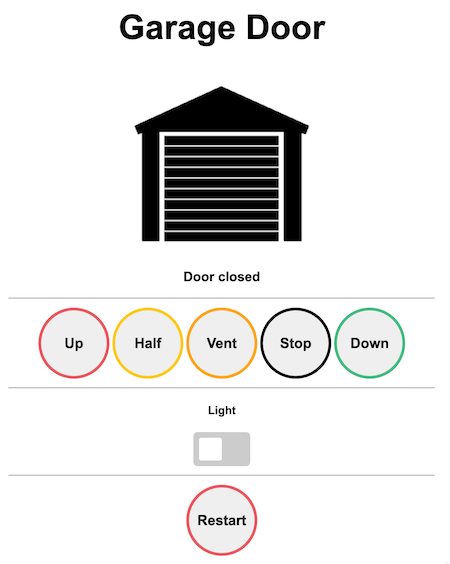
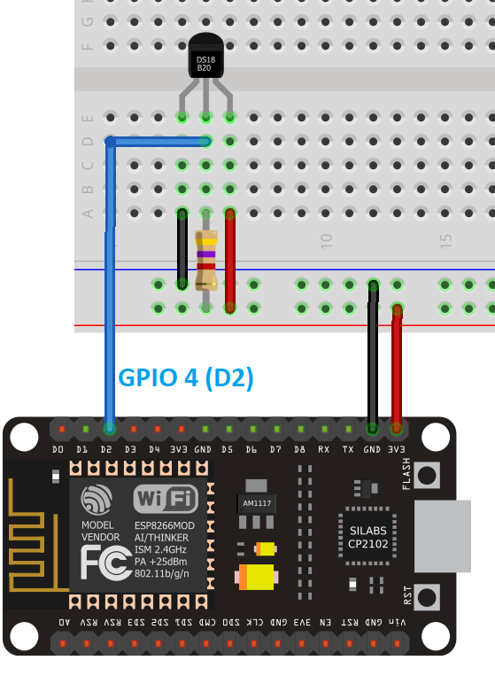
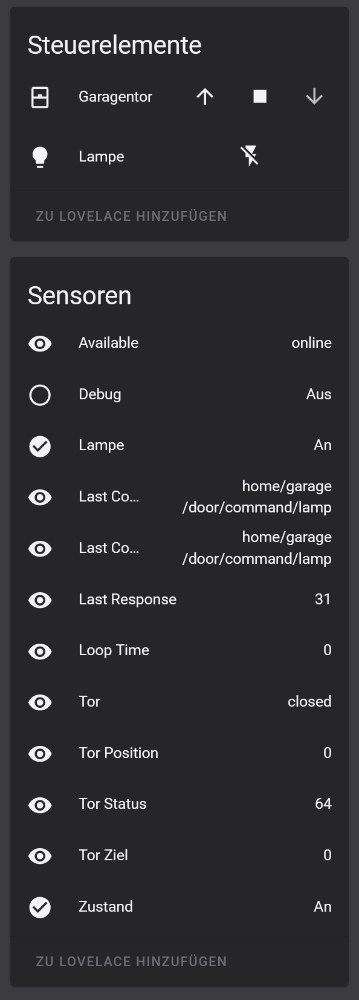

NOTE: this is a fork of the work of various people who did 99% of the work. I just did some cleanups, translated to english and fixed various bugs.

# HCPBridge with MQTT + HomeAssistant Support


Emulates Hörmann UAP1-HCP board using an ESP32 and a RS485 converter, and exposes garage door controls over web page and MQTT.

**Compatible with the following motors (UAP1-HCP / HCP2-Bus / Modbus):**

* SupraMatic E/P Serie 4
* ProMatic Serie 4

It is **not** compatible with E3 series motors. Previous generations have different protocol, different pin layout, and already have another supporting project.

## Functions

* Get current status (door open/close/position, light on/off)
* Trigger the actions (light on/off, gate open, close, stop, half and ventilation position)
* Web Interface
* Web Service (GET)
* OTA Update (with username and password)
* Added AsyncWifiManger (hotspot when disconnected)
* DS18X20 temperature sensor (with threshold)
* Efficient MQTT messages (send only MQTT Message if Door state changed)

## Known Bugs
* Open command requires two clicks. A feature? :)
* On Promatic4 (at least) the status led of the motor blinks red.

## Notes by original author

Eigentlich war das Ziel, die Steuerung komplett nur mit einem ESP8266 zu realisieren, allerdings gibt es durch die WLAN und TCP/IP-Stackumsetzung Timeoutprobleme, die zum Verbindungsabbruch zwischen dem Antrieb und der Steuerung führen können. Durch die ISR-Version konnte das Problem zwar reduziert aber nicht komplett ausgeschlossen werden. Daher gibt es zwei weitere Versionen, die bisher stabil laufen. Eine Variante nutzt den ESP32 statt ESP8266, welcher über 2 Kerne verfügt und so scheinbar besser mit WLAN-Verbindungsproblemen zurecht kommt. Die andere Option ist ein zweiter MCU, der die MODBUS Simulation übernimmt, sodass sich der ESP8266 nur noch um die Netzwerkkommunikation und das WebInterface kümmern muss.

## Web Interface

***http://[deviceip]



## Web Service

### Commands

***http://[deviceip]/command?action=[id]***

| id | Function |
|--------|--------------|
| 0 | Close |
| 1 | Open |
| 2 | Stop |
| 3 | Ventilation |
| 4 | Half Open |
| 5 | Light toggle |
| 6 | Restart |

### Status report

***http://[deviceip]/status***

Response (JSON)

```
{
 "valid" : true,
 "doorstate" : 1,
 "doorposition" : 0,
 "doortarget" : 0,
 "lamp" : true,
 "debug" : 0,
 "lastresponse" : 0
}
```

### Wifi Status

***http://[deviceip]/sysinfo***

### OTA Firmware update (AsyncElegantOTA):

***http://[deviceip]/update***

## Pinout RS485 (Plug)


1. GND (Blue)
2. GND (Yellow)
3. B- (Green)
4. A+ (Red)
5. \+24V (Black)
6. \+24V (White)

## RS485 Adapter

  
Pins A+ (Red) and B- (Green) need a 120 Ohm resistor for BUS termination. Some RS485 adapters provide termination pad to be soldered.

## DS18X20 Temperature Sensor

 <br/>
DS18X20 connected to GPIO4.

## Circuit


ESP32 powering requires a Step Down Module such as LM2596S DC-DC, but any 24VDC ==> 5VDC will do, even the tiny ones with 3 pin.
Please note that the suggested serial pins for serial interfacing, on ESP32, are 16 RXD and 17 TXD.

It is possible to implement it with protoboard and underside soldering:


## Installation


* Connect the board to the BUS
* Run a BUS scan: 
  * Old HW-Version / Promatic4: BUS scan is started through flipping (ON - OFF) last dip switch. Note that BUS power  (+24v) is removed when no devices are detected. In case of issues, you may find useful to "jump start" the device using the +24V provision of other connectors of the motor control board.
  * New HW version: with newer HW versions, the bus scan is carried out using the LC display in menu 37. For more see: [Supramatic 4 Busscan](https://www.tor7.de/news/bus-scan-beim-supramatic-serie-4-errorcode-04-avoid)

# HCPBridge MQTT (HomeAssistant topics)

This is just a quick and dirty implementation and needs refactoring, but it is working.
Using the Shutter Custom Card (from HACS) it is also possible to get a representation of the current position of the door.


