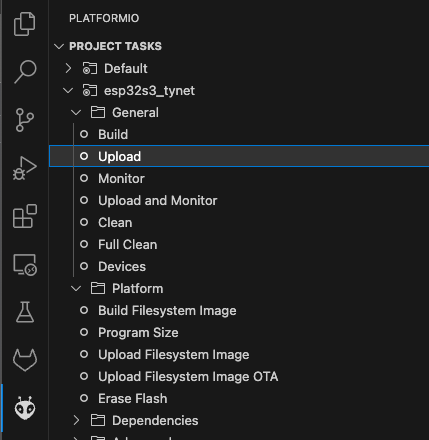

# How to Flash the Firmware

## Setup Software

Download and install VS Code from Microsoft to your Computer: https://code.visualstudio.com/download

After that open VS Code and go to extensions, search for Platform IO and install it, follow any instructions if a restart or something is needed

## Get Firmware

On the Main Repo click the green Get Code Button and download the firmware as a zip.
Extract the Zip File and remember where you put it on your Computer.
Go to VSCode, click the PlatformIO Symbol at the bottom to switch to the Plugin UI.
Click the Open Folder button and select the HCPBridgeESp32 Folder inside the extracted Firmware.

## Configuration

In this step you can preset the preferences. On first boot they will be stored on the Memory of the ESP. 
After you have to change it from the WEB ui or Reset the ESP memory to load again the data from the configuration file.
Use the left Sidebar again and click on the Folder Symbol to switch to the File List.
Before you can flash the Firmware you will need to change the Configuration in the configuration.h File located in the src Folder.

You need to set your WIFi Name/SSID and Password as well as the Connection Details to your MQTT Server if you want to use that Feature.

## Build and Flash

Go back to the Platform IO UI and click on the ESP Model you got under "Project Tasks".
ESP32 for older Boards and ESP32S3 for newer Boards (for example all PCBs with a Tynet logo)
Open the General Tasks of the Board you got and click Build.

This should prepare the Firmware for your Board including your Configuration, if all goes well the Terminal will show a green success message.

If this works you can connect your Device and click the Upload Task to flash it, this should also result in a Success info in green text inside the Terminal.

After this you can replug your device from USB to restart it and it should connect to your WIFI Router and MQTT Server.

Now you can connect it via the RJ12 cable to your garage door and start the BUS Scan, if all works the two communication leds should blink fast.
With this the MQTT as well as web controls on the devices IP should also work and you are Done :)
